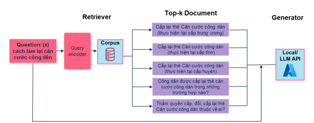
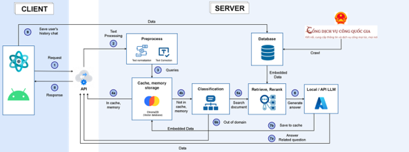
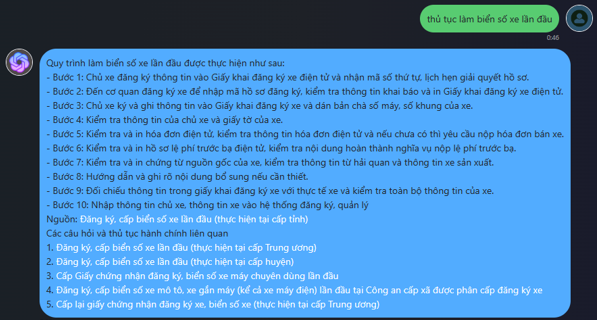

# Đồ án môn học: HỆ THỐNG HỎI ĐÁP DỊCH VỤ CÔNG

# 1. Giới thiệu

Kỹ thuật chính mà nhóm dùng để xây dựng chatbot này là kỹ thuật Retrieval-Augmented Generation (RAG) cùng với một số kỹ thuật khác để xây dựng các tính năng của chatbot. \
Chi tiết về cách thực hiện xem trong file report.pdf

# 2. Kỹ thuật Retrieval-Augmented Generation - RAG

## Kiến trúc của RAG

Trong mô hình RAG sẽ có 3 thành phần:

- Corpus: Kho dữ liệu bên ngoài để cung cấp thêm thông tin cho bộ phận generator
- Retriever: Từ một câu truy vấn x, trước tiên, mô hình RAG sẽ truy xuất một top-k các tài liệu hoặc đoạn văn có liên quan đến X từ một corpus bên ngoài. Điều này được thực hiện bằng cách sử dụng cơ chế truy xuất, thường dựa trên các biểu diễn vectơ của tài liệu và câu truy vấn.
- Generator: Sau khi các đoạn văn hoặc tài liệu có liên quan được truy xuất, chúng sẽ kết hợp cùng với câu truy vấn ban đầu đề đưa vào các mô hình tạo sinh văn bản. Sau đó, mô hình này tạo ra phản hồi, tận dụng cả kiến thức và thông tin được đào tạo trước từ các đoạn văn được truy xuất.

## Các bước thực hiện của RAG:

**Hình 1. Sơ đồ các bước thực hiện của RAG**

- Question: Đây là câu truy vấn mà người dùng muốn được trả lời
- Retriever: Hệ thống mã hóa câu truy vấn đầu vào để tìm kiếm các tài liệu hoặc đoạn văn bản có trong kho dữ liệu.
- Top-k documents: Sau bước truy vấn ta thu được top-k tài liệu liên quan đến câu truy vấn ban đầu nhất.
- Kết hợp Question + Top-k documents: Kết hợp câu truy vấn ban đầu và tài liệu truy xuất được lại với nhau để tạo thành prompt cho bộ phận generator. Sự kết hợp này cung cấp ngữ cảnh phong phú mà hệ thống sẽ sử dụng để tạo ra câu trả lời cuối cùng.
- Generator: Sử dụng prompt ở trên vào các mô hình ngôn ngữ lớn để tạo ra các câu trả lời mạch lạc, tự nhiên. Nó sẽ cung cấp phản hồi dựa trên khối lượng dữ liệu khổng lồ mà đã đã được học cùng với thông tin ngữ cảnh mà ta đã bổ sung vào.
- Output (answer): Đây là câu trả lời cuối cùng mà hệ thống tạo ra để trả lời truy vấn đầu vào ban đầu.

# 3. Cấu trúc hệ thống

**Hình 2. Cấu trúc hệ thống của ứng dụng**

Hệ thống Chatbot của chúng tôi được thiết kế như Hình 2, với chi tiết quy trình như sau:

- Giai đoạn 1 - Tiền xử lý: Trước khi đưa câu hỏi người dùng vào hệ thống để tìm trong dữ liệu cũng như tạo câu phản hồi thì chúng tôi cho câu hỏi qua các bước tiền xử lý như sau:
  - Chuẩn hoá: Chúng tôi chỉnh sửa các câu hỏi về một dạng thống nhất cũng như dạng giúp chúng tôi đảm bảo được hiệu suất cao khi dùng để tìm kiếm trong database ở giai đoạn sau. Các bước trong chuẩn khoá có thể kể đến như:
    Sửa định dạng từ
    - Sửa dấu từ
    - Bỏ các khoảng trắng trùng lặp
  - Thêm dấu cho câu. Để khiến câu hỏi thêm tin cậy cũng như chính xác cho các giai đoạn sau, câu hỏi tra qua một bộ thêm dấu để hoàn tất việc thêm dấu cho câu
- Giai đoạn 2 - Gợi nhớ: Ở giai đoạn này các câu hỏi của người dùng sẽ được kiểm tra có ở trong bộ nhớ đệm hay không từ đó quyết định trả về câu trả lời có sẵn hoặc tiếp tục tìm kiếm thông tin. Điều này là rất cần thiết bởi nhờ đó chúng ta có thể giảm thiểu thời gian, chi phí khi vận hành.
- Giai đoạn 3 - Phân loại: Nếu câu hỏi người dùng không ở trong bộ nhớ của server ta sẽ tiến hành phân loại câu để kiểm tra câu hỏi có thuộc lĩnh vực dịch vụ công hay không, nếu thuộc thì tiếp tục bước sau, không thì trả về kết quả luôn cho người dùng
- Giai đoạn 4 - Tìm kiếm: Sau khi nhận được các câu truy vấn từ giai đoạn 3, ta bắt đầu tìm kiếm trên toàn database để đưa ra kiến thức, dữ liệu cho giai đoạn 5.
- Giai đoạn 5 - Kiến tạo: Bằng cách tận dụng sức mạnh của mô hình ngôn ngữ lớn - GPT 3-5, ta đưa vào câu hỏi gốc của người dùng và các kiến thức có được từ giai đoạn 4 để có thể tạo ra một câu trả lời tự nhiên, gần gũi, có tính logic với người đọc.

# 4. Demo ứng dụng

**Hình 3. Minh họa ứng dụng: Mở đầu cuộc trò chuyện của hệ thống**

**Hình 4. Minh họa ứng dụng: Không hỗ trợ câu hỏi không thuộc lĩnh vực dịch vụ công**

**Hình 5. Minh họa ứng dụng: Câu trả lời có trích xuất nguồn, có đề xuất các thủ tục liên quan**

**Hình 6. Minh họa ứng dụng: Hiểu câu hỏi không dấu**

